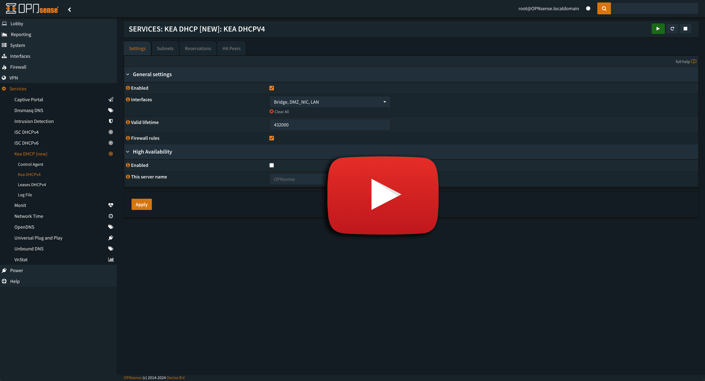

# Migration

Migration is a utility that will take your static IP address mappings in OPNsense and migrate them over to the Kea DHCP server that comes with OPNsense version 24.

- **You <u>must</u> upgrade to OPNsense version 24 before using this utility**

### Here is a video tutorial if that works best for you

[](https://youtu.be/qoGY6--vEK4)

### This is a simple tool to use:

1) [Download the program](https://github.com/EasyG0ing1/Migration/releases/latest) for your operating system (they are native binaries, no need for a Java runtime environment).
    * Create a clean folder to put the program in
2) From your OPNsense interface, go to Services / Kea DHCP / Kea DHCPv4 Then Subnets on the right
3) Define all of your subnets and their IP Pools.
    * The tool uses those newly created subnets to automatically assign your current reservations to the correct subnet.
4) Apply those changes
5) Go to System / Configuration / Backups
6) Click on Download Configuration
    * Save the file as `config.xml` in the same folder you downloaded to tool into
    * Make a copy of it just in case
7) Open a shell (cmd.exe or terminal etc.) and go into that folder
8) run `migrate`
    - You should see that the file `new_config.xml` has been created
    - If you don't then you will see a description of some problem that was found which will help you understand what needs to be fixed in your config.xml file
9) Go back into OPNsense under backups and restore this new file.
   - Make sure you UNCKECK the box that says Reboot after restore

Done!

### [Binaries](https://github.com/EasyG0ing1/Migration/releases/latest)
The binaries were compiled and tested in these operating systems

- Windows 11 (build 21996.1)
- MacOS Sonoma 14.2.1
- Ubuntu 22.0.4 LTS (Jammy Jellyfish)

No guarantees with older versions of these operating systems.

## Summary of what this utility does
* Loads config.xml into memory
* Loads existing static maps into memory from the `staticmap` xml node
* Loads the Kea subnets from the `subnet4` xml node
* Iterates through each static mapping
  * Compares each IP address with the Kea Subnets you created looking for a match
  * Creates a new Kea DHCP static mapping using the subnet UUID from the matched subnet
  * Assigns a new random UUID to the new static map for Kea
* Converts the new mappings into xml under the node name `reservations`
* Replaces the `reservations` xml node from the original `config.xml` file
* Saves the modified xml to a new file named `new_config.xml`

Every step along the way is checked for problems and if any are found, the program tells you exactly what you need to look for to settle the problem.

## Compiling
If you are a glutton for punishment and you want to compile the code yourself, these instructions will work for MacOS and Linux (sorry Windows, no love today :-)
- First, install SDK Man
```shell
curl -s "https://get.sdkman.io" | bash
```
- It will give you a command to copy and paste into terminal that will source the config, or simply restart your terminal.
- Next, install GraalVM v21
```shell
sdk install java 21.0.2-graal
```
(this takes about a minute-ish)
- Install Maven
  - Pick a folder to hold the maven file tree
  - Go into that folder
```shell
cd /My/Folder
wget https://dlcdn.apache.org/maven/maven-3/3.9.6/binaries/apache-maven-3.9.6-bin.zip
unzip apache-maven-3.9.6-bin.zip
mv apache-maven-3.9.6 maven3.9.6
```
- Edit whatever file you use to run exports when your shell starts and add
```shell
export PATH="/My/Path/To/maven3.9.6/bin":$PATH
```
- Run that command in your terminal too so that you don't need to restart terminal
- Run this and expect the output shown here
```shell
mvn --version
```
Output
```text
Apache Maven 3.9.6
Maven home: /My/Path/To/maven3.9.6/libexec
Java version: 21, vendor: Oracle Corporation, runtime: /Library/Java/JavaVirtualMachines/graalvm-jdk-21+35.1/Contents/Home
```

- If you're using MacOS and you DON'T have the xcode command line tools installed, run this
```shell
xcode-select install
```
- And it will take a LOOOONG time to finish - possibly up to 20 minutes or longer. Get some coffee or water or popcorn ...
- If you're using Linux, then you need to install this
```shell
sudo apt update
sudo apt install build-essential libz-dev zlib1g-dev -y
```
- This won't take too long to install
  - We're back to ALL OS's from here
- Next, go into a folder you can clone this repository into then
```shell
git clone https://github.com/EasyG0ing1/Migration.git
cd Migration
mvn clean -Pnative native:compile
ls -l target
```
- You should see the `migrate` binary in the target folder.
- You may need to set it as executable
 ```shell
chmod +x migrate
```

Depending on your machine, the compiling process can take anywhere from a minute or so up to several minutes or even well over 10 minutes. It all depends on your processor and your memory.

### Issues
If you have any problems that you can't figure out, create an issue and I will be happy to assist.

### Contributing
Create an Issue or a Pull Request if you want to contribute to the project.

### Updates

* 2.1.2
  * Fixed problem where xml tags were in the wrong case in the `new_config.xml`
 
2.1.1
  * Added clear and expanded error messages so that any problems that might happen should always present the user with a clear and exact cause of the problem along with instructions explaining how to correct the problem

* 2.1.0
  * Removed the need to run a check before doing the migration
  * Users will get specific feedback if there are any problems which will let them know exactly what is wrong if there are any problems with the migration.

* 2.0.1
  * Minor enhancements

* 2.0.0
  * Streamlined use of XML library, eliminating unnecessary calls.
  * Program now outputs a file that can be directly imported into OPNsense

* 1.0.1
  * Added more detailed error reporting

* 1.0.0
  * Initial Release
