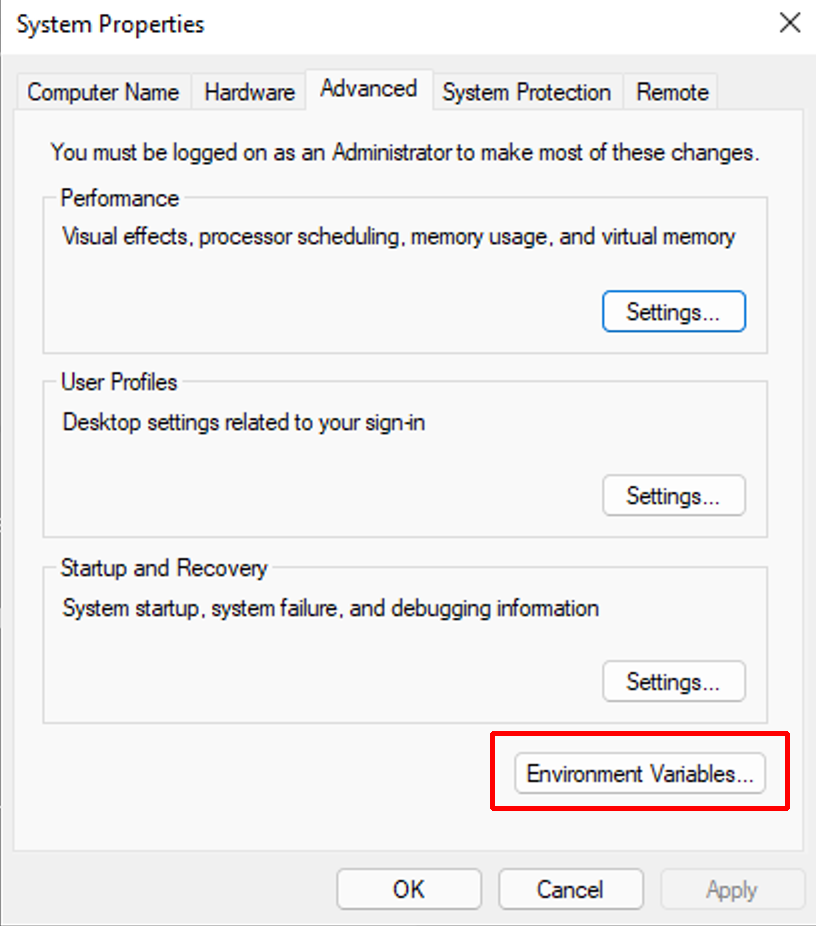
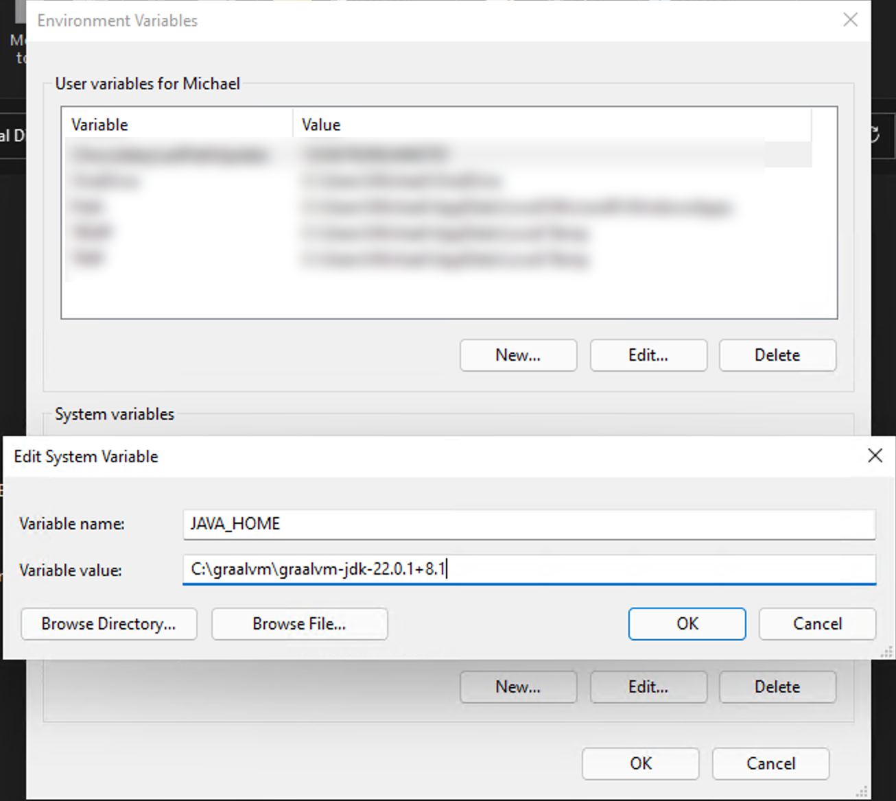
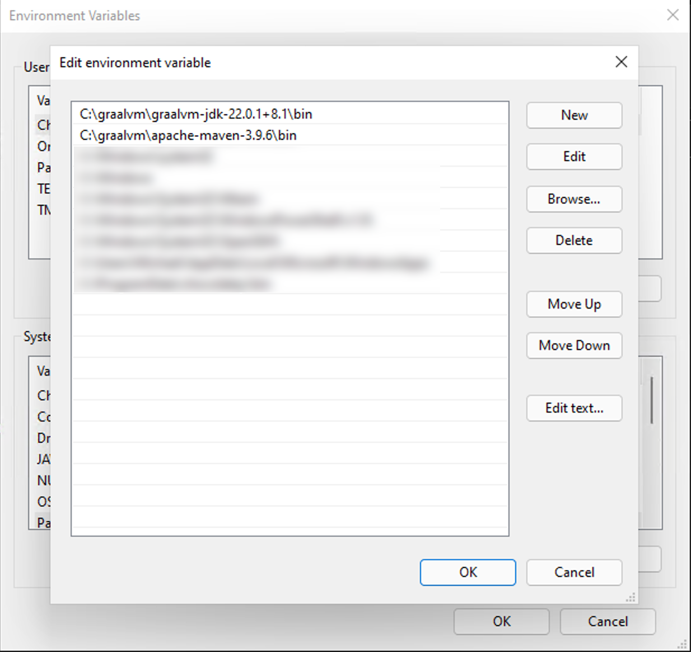
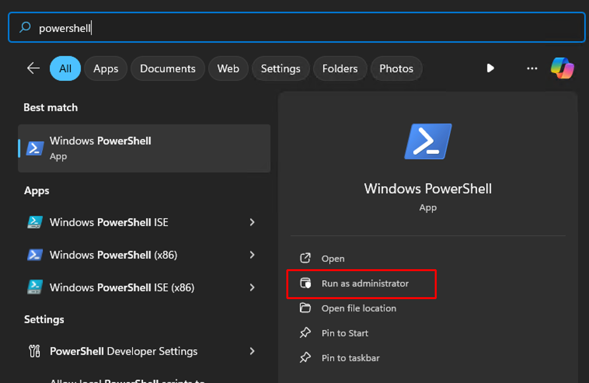
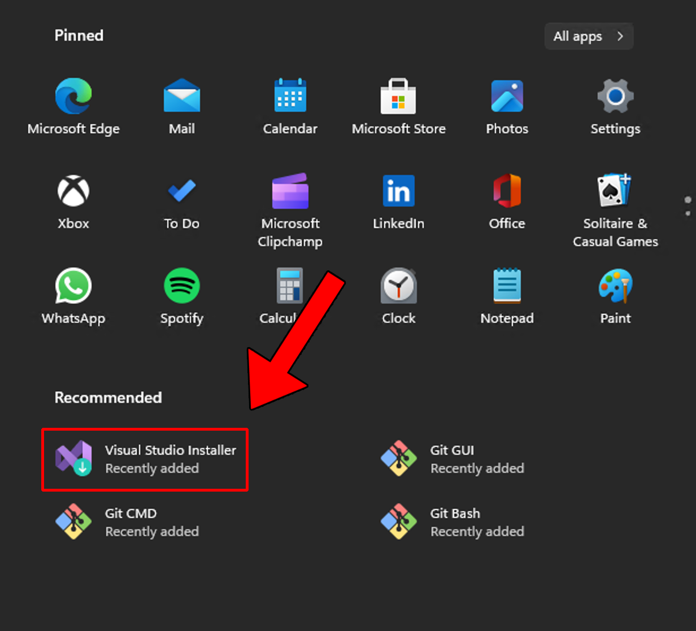
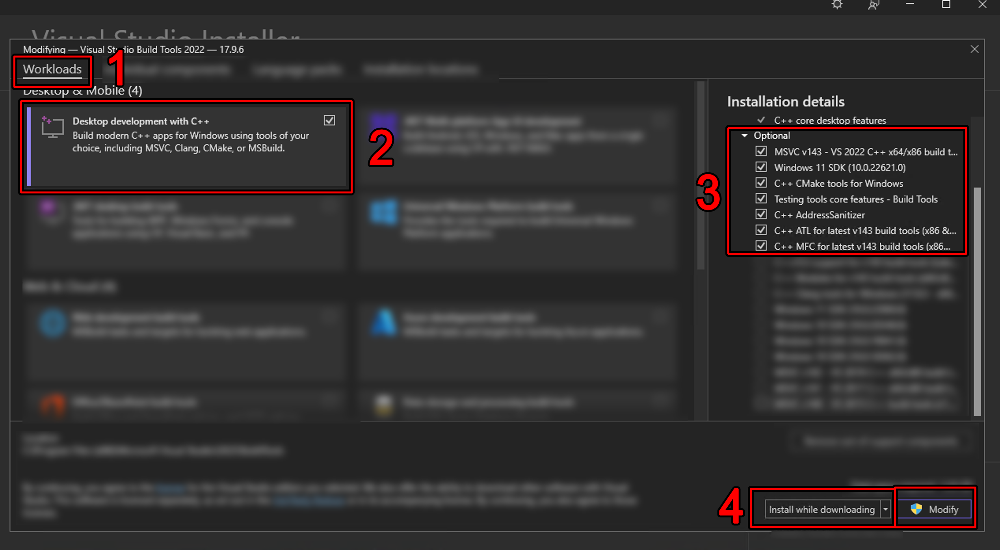
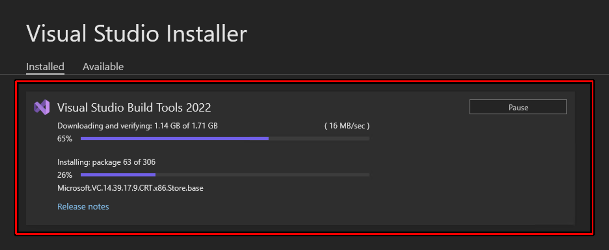
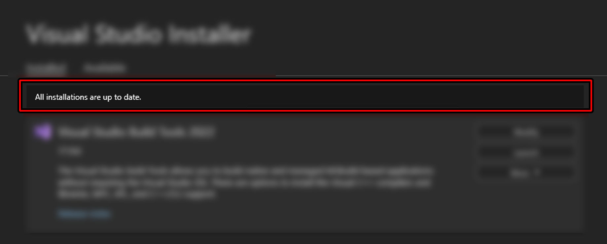
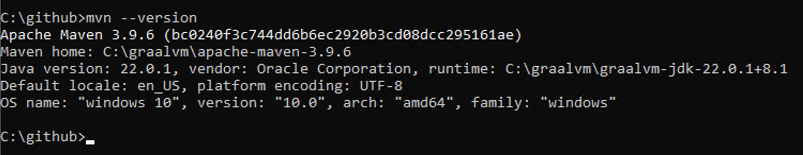

## Windows Build Environment

If you have the ability to use a virtual machine and a clean install of Windows, that would be your best option. That
way, when were're finished, you just delete the VM after you have your binary file. If not, no worries; we'll have a
clean up process when we're done to remove the build tools that you'll need to install to make this binary.

You will need:

* GraalVM with Java version 22 and you can download it [here](https://www.graalvm.org/downloads/#)
  Chose Java 22 and your Windows version then Download.
* Apache Maven which you can [download here](https://maven.apache.org/download.cgi). Get the Binary zip archive under
  Link.
* Visual Studio Build Tools (install steps below)

Create a folder off of the root of C and call it graalvm.

Next, extract the GraalVM downloaded zip file into that folder. This should end up with a path that looks similar to
this: `C:\graalvm\graalvm-jdk-22.0.1+8.1`

Next, extract the Maven zip file to the same folder which will give you path similar to
this: `C:\graalvm\apache-maven-3.9.6`

Next, you need to edit the environment variables so that the build tools know where to find Java and Maven.

Right click on This PC, Properties, and then click on Advanced system settings. Then click on the button that says
Environment
Variables

[]()

Next, you will need to create a new System environment variable named `JAVA_HOME`

[]()

The path needs to be the path that you extracted the graalvm zip file and it should look similar to whats in the picture
above.

Next, you need to edit the Path environment variable under System variables by double clicking it, then click New and
add a path to the `bin` folder of both GraalVM and Apache Maven and they should end up looking similar to this:

[]()

Keep clicking OK to get out of those windows.

## Install Winget

Open a Powershell as administrator by tapping the Windows key on your keyboard, then just type in powershell and click
on the Run as Administarator oprion.

[]()

Once powershell is open, run this:

```bash
Add-AppxPackage -RegisterByFamilyName -MainPackage Microsoft.DesktopAppInstaller_8wekyb3d8bbwe
```

You can close powershell now.

But here's the thing ... I don't know why, but after you run that command, it takes some time for the `winget` program
to actually install, and you won't see anything indicating that it is installing or that it was installed ... you just
have to wait. In my case, I tried opening and re-opening a CMD shell (fastest way to do that is to hold down the Windows
key, press `R` type `cmd` and hit enter) and typing `winget` to see if it was installed but
after several minutes, it wasn't so I just went and did other stuff for a while then came back like 15 minutes later and
opened a `CMD` shell,
typed in `winget` and walla! There it was!

Once that is working, you can install `git` like this:

```bash
winget install --id Git.Git -e --source winget
```

That install you will see happening in real time. Once it's installed, you need to exit out of the cmd shell and open a
new one so that the changes it makes to the path are applied to the active shell.

Once git is installed, we need to install the Visual Studio Tools. Start by installing the installer:

```bash
winget install Microsoft.VisualStudio.2022.BuildTools --exact
```

After that completes, open the installer by tapping the Windows key, then click on the installer.

[]()

When that opens, click on these items in the order that they are numbered:

[]()

1) Workloads
2) Desktop Development with C++
3) Make sure all the same boxes are checked and if there are no exact matches, get the latest version of each option
   checked.
4) If your Internet connection is more than 50 megabits, chose `Install While Downloading` if less than that, chose the
   option to download first then install.
5) Click on `Modify`

Go get some coffee ... or water ... nuke some popcorn ... this will take some time.

You will see it downloading ...

[]()

Then when you see this message

[]()

You can close the installer.

Now, open a new `CMD` window (again, the easiest way to do that is to hold down the Windows key on your keyboard and
then
press `R`; then type in `cmd` and hit enter)

Next, create a github folder off the root

```bash
mkdir C:\github
cd C:\github
```

type: `mvn --version` and hit enter. You should see something that looks like this:

[]()

Go back to the [README](https://github.com/EasyG0ing1/Migration) 
